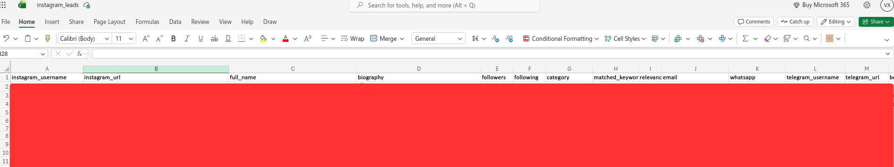

# Instagram Lead Generation Tool

A Python tool that finds Instagram profiles of coaches, consultants and other
service-based experts and extracts every contact channel they've published
(email, WhatsApp, Telegram, booking links and websites) into a ready-to-use
Excel sheet.

Built as a lead generation pipeline: search by niche keyword, filter out
businesses/shops and accounts that don't fit the audience-size profile, then
mine each remaining bio for a way to reach that person directly.

## How it works

```
source (Apify / HikerAPI) -> normalize -> filters -> contact extraction -> dedup -> Excel
```

### Pluggable source adapters

`ApifySource` and `HikerApiSource` both implement the same `discover()` /
`enrich()` interface and are normalized into one `Profile` dataclass by
`normalize_profile()`. Apify is convenient for a quick test batch; HikerAPI is
cheaper per request and used for volume runs. Swapping or adding a source
means writing one adapter class; the rest of the pipeline is untouched.

### Multi-stage filtering funnel

Each keyword's results pass through a sequence of independent filters
(duplicate check, optional geo/keyword exclusion, follower-count range,
niche-keyword match, contact-found check, duplicate-contact check), and every
stage's pass/drop counts are logged per keyword, so it's possible to see
exactly where profiles are being lost, not just the final count.

### Multi-channel contact extraction

Rather than requiring one specific contact method, the tool tries every
channel found in a profile's bio and external links:

- **Email**: the provider's business/public email field if the API exposes
  one, otherwise a regex scan of the bio.
- **WhatsApp**: phone number parsed out of `wa.me/...` or
  `whatsapp.com/send?phone=...` links (WhatsApp has no usernames).
- **Telegram**: see below.
- **Booking link**: Calendly, Cal.com, Koalendar, TidyCal, Acuity Scheduling.
- **Website**: whatever's left in the bio link once the above are ruled out
  (link-in-bio aggregator pages like Linktree are excluded from this, since
  they're a landing page, not the expert's own site).

A profile is kept if it yields **at least one** of these; no single channel
is mandatory.

On a sample run, 9 of 10 usable contacts came from this deep resolution rather
than from the bio itself. Without it the same profiles would have yielded
almost nothing.

### Telegram link-type detection

Instagram bios often link to a Telegram bot or public channel instead of a
personal account. `classify_tme_target()` resolves each `t.me/<handle>` and
classifies it as `bot` / `channel` / `personal` by reading the page markup
(action button text, subscriber/member counters), and only personal accounts
are kept as a usable contact. Link-in-bio pages (Linktree, Taplink, ...) are
also fetched and scanned for a personal Telegram link. Results are cached so
no link is fetched twice.

### Deduplication & relevance scoring

Profiles are deduplicated both by Instagram username and by Telegram handle
(the same person can otherwise surface under two different keyword searches).
Each kept profile also gets a `relevance_score`, a count of bio-language
signals like "book a call" or "free consultation", used to sort the most
promising leads to the top of the sheet.

### Optional geo/keyword exclusion

`--exclude-countries` accepts any list of free-text markers (city names,
country names, any word) and drops profiles whose bio/name/category mentions
one of them. It's off by default and implemented as a single, generic
substring-matching function, so it isn't tied to any particular market.

## Stack

Python 3.14 · [apify-client](https://pypi.org/project/apify-client/) ·
[hikerapi](https://pypi.org/project/hikerapi/) · pandas · openpyxl · requests

## Installation

```bash
python -m venv .venv
source .venv/bin/activate
pip install -r requirements.txt
```

## Usage

```bash
# Quick test batch via Apify
export APIFY_TOKEN="your_apify_token"
python insta_parser.py --source apify --limit 50

# Volume run via HikerAPI
export HIKER_TOKEN="your_hiker_token"
python insta_parser.py --source hiker --limit 500

# Custom keyword list, custom output file, geo exclusion
python insta_parser.py --source apify --limit 50 \
    --keywords "life coach" "business coach" \
    --out leads.xlsx \
    --exclude-countries ukraine kyiv
```

### CLI options

| Flag | Default | Description |
|---|---|---|
| `--source` | `apify` | `apify` or `hiker` |
| `--limit` | `50` | number of unique contacts to collect |
| `--per-keyword` | `30` | profiles fetched per keyword before filtering |
| `--out` | `instagram_leads.xlsx` | output file path |
| `--keywords` | built-in niche list | override the keyword list |
| `--exclude-countries` | none | optional bio/name/category exclusion markers |

## Environment variables

| Variable | Required for |
|---|---|
| `APIFY_TOKEN` | `--source apify` |
| `HIKER_TOKEN` | `--source hiker` |

## Output

An `.xlsx` file with one row per lead:

`instagram_username, instagram_url, full_name, biography, followers, following,
category, matched_keyword, relevance_score, email, whatsapp, telegram_username,
telegram_url, booking_link, website, notes`

Values that could be misread as Excel formulas (starting with `@`, `=`, `+`,
`-`) are automatically escaped.



## Note on data sources

Profile data is retrieved through third-party API providers (Apify, HikerAPI),
not by scraping Instagram directly.
